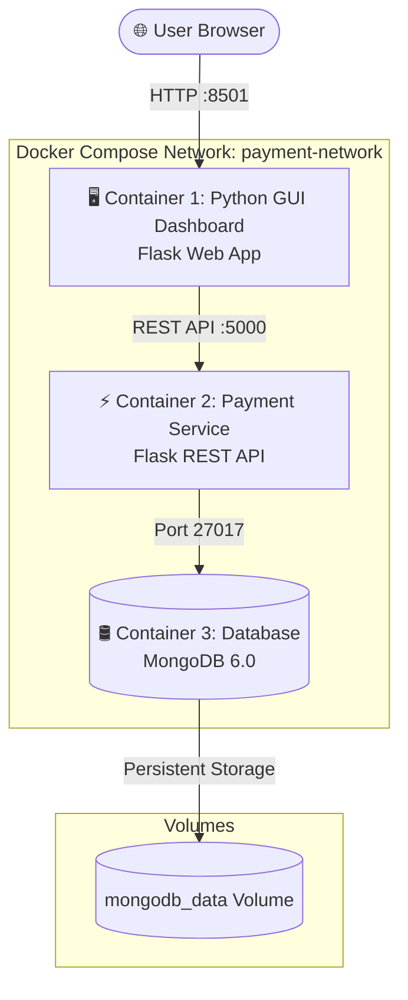

# Containerized Payment Application Dashboard 💳

A full-stack, 3-tier microservice payment application built with **Python Flask (GUI Web App)**, **Flask (REST API Backend)**, and **MongoDB**, fully containerized using **Docker** and orchestrated with **Docker Compose** and **Kubernetes**.

---

## 📋 Deliverables Summary

1. **Python GUI Source Code**: Enterprise SaaS Web Dashboard (`gui/app.py`, `templates/`, `static/`).
2. **Payment REST API Source Code**: Backend Payment Microservice (`backend/app.py`).
3. **Dockerfiles**: Production-grade multi-stage Dockerfiles (`backend/Dockerfile`, `gui/Dockerfile`).
4. **Docker Compose Configuration**: 3-container orchestration stack with health checks (`docker-compose.yml`).
5. **Phase 2 Cloud Manifests**: Kubernetes manifests (`k8s/`) and cloud automated deployment script (`deploy_cloud.sh`).
6. **Postman Test Collection**: Pre-configured Postman JSON collection (`postman_collection.json`).

---

## 🔑 API Keys & Credentials Summary

| Credential Type | Key / Value | Location / Usage |
| :--- | :--- | :--- |
| **Live Production API Secret Key** | `sk_live_9f82a10b4c739e1204d` | Merchant Profile / API Header `Authorization: Bearer sk_live_9f82...` |
| **MongoDB Root Username** | `root` | `docker-compose.yml` / `.env.example` |
| **MongoDB Root Password** | `password` | `docker-compose.yml` / `.env.example` |
| **MongoDB Database Name** | `payment_db` | Collection database store |

---

## 🏗 Architecture & Container Specifications



| Container | Image | Port | Description |
| :--- | :--- | :--- | :--- |
| **`gui`** | `python:3.11-slim` | `8501` | Enterprise SaaS Payment Dashboard (Flask, HTML5, CSS3, Chart.js) |
| **`payment-service`** | `python:3.11-slim` | `5000` | Payment Processing REST API & Business Validation |
| **`mongodb`** | `mongo:6.0` | `27017` | Persistent Database with volume storage (`mongodb_data`) |

---

## 🚀 Phase 1: Local Deployment (Docker & Docker Compose)

### 1. Launch Containers
```bash
docker compose up -d
```

### 2. Access Local Ports
- **GUI Dashboard**: 👉 **[http://localhost:8501](http://localhost:8501)**
- **Payment REST API**: 👉 **[http://localhost:5000/health](http://localhost:5000/health)**

---

## ☁️ Phase 2: Cloud Deployment Guide

### Option A: Kubernetes Cloud Deployment (AWS EKS / GCP GKE / Azure AKS / Minikube)

Run the automated cloud deployment script:
```bash
chmod +x deploy_cloud.sh
./deploy_cloud.sh
```

Or apply Kubernetes manifests step-by-step:
```bash
kubectl apply -f k8s/mongodb-deployment.yaml
kubectl apply -f k8s/backend-deployment.yaml
kubectl apply -f k8s/gui-deployment.yaml
kubectl apply -f k8s/ingress.yaml
```

Access the Cloud Ingress or Service URL:
```bash
minikube service payment-gui-service
```

---

### Option B: AWS Elastic Container Service (ECS Fargate)

1. **Tag and Push Docker Images to AWS ECR**:
   ```bash
   aws ecr get-login-password --region us-east-1 | docker login --username AWS --password-stdin <AWS_ACCOUNT_ID>.dkr.ecr.us-east-1.amazonaws.com
   
   docker tag payment-payment-service <AWS_ACCOUNT_ID>.dkr.ecr.us-east-1.amazonaws.com/payment-service:latest
   docker push <AWS_ACCOUNT_ID>.dkr.ecr.us-east-1.amazonaws.com/payment-service:latest

   docker tag payment-gui <AWS_ACCOUNT_ID>.dkr.ecr.us-east-1.amazonaws.com/payment-gui:latest
   docker push <AWS_ACCOUNT_ID>.dkr.ecr.us-east-1.amazonaws.com/payment-gui:latest
   ```

2. **Create AWS ECS Fargate Task Definition** with the 3 container definitions linked via AWS Private VPC security groups.

---

### Option C: GCP Cloud Run / Azure Container Apps

Push containers to Google Artifact Registry / Azure Container Registry and deploy serverless container revisions linked to a managed MongoDB Atlas instance.

---

## 📮 Postman API Testing Collection

Import the pre-configured Postman JSON collection into Postman:  
📁 **[postman_collection.json](file:///c:/Users/Bisht/OneDrive/Desktop/payment/postman_collection.json)**

### Sample REST Endpoints (Port `5000`):
- `GET http://localhost:5000/health` (Health Check)
- `GET http://localhost:5000/api/stats` (Analytics Stats)
- `GET http://localhost:5000/api/payments` (List Payments)
- `POST http://localhost:5000/api/payments` (Process Payment)
- `GET http://localhost:5000/api/cards` (Saved Credit Cards)
- `GET http://localhost:5000/api/profile` (Merchant Profile)
