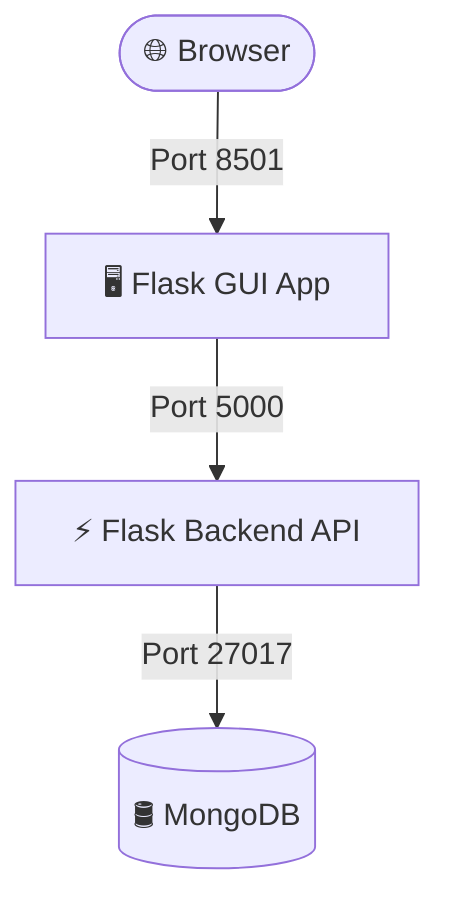

# SimplePay Dashboard 💳

A full-stack, 3-tier payment application dashboard built with **Python Flask (GUI Web App)**, **Flask (REST API Backend)**, and **MongoDB**, containerized using **Docker**.

## 🌐 Live Demo
Access the live production deployment hosted on Render and MongoDB Atlas:
👉 **[https://simplepay-946w.onrender.com](https://simplepay-946w.onrender.com)**

---

## 🏗️ Architecture Stack

* **Frontend**: Python Flask GUI serving a compiled React Single Page Application (SPA).
* **Backend**: Python Flask REST API processing payment operations.
* **Database**: MongoDB (Local Docker container for development, MongoDB Atlas for production).



---

## 🚀 Getting Started (Local Run)

To run the complete application stack locally on your machine, ensure you have Docker installed and run:

```bash
docker compose up -d --build
```

### Access Ports:
* **GUI Dashboard**: 👉 [http://localhost:8501](http://localhost:8501)
* **Backend REST API**: 👉 [http://localhost:5000/health](http://localhost:5000/health)

---

## 📮 Key API Endpoints (Port 5000)

* `GET /health` - Service health status
* `GET /api/stats` - Payment analytics and statistics
* `GET /api/payments` - Retrieve transaction list
* `POST /api/payments` - Process a new payment transaction
* `GET /api/cards` - List saved credit cards
* `GET /api/profile` - Retrieve merchant profile details
