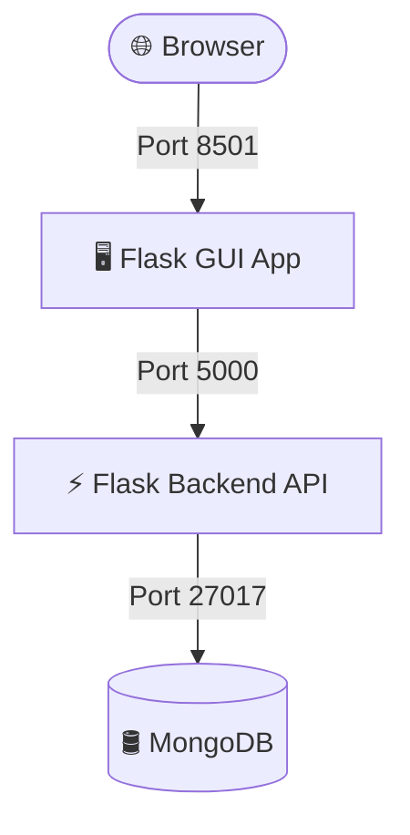

# SimplePay Dashboard 💳

A full-stack, 3-tier payment application dashboard built with **Python Flask (GUI Web App)**, **Flask (REST API Backend)**, and **MongoDB**, containerized using **Docker**.

## 🌐 Live Demo
Access the live production deployment hosted on Render and MongoDB Atlas:
👉 **[https://simplepay-946w.onrender.com](https://simplepay-946w.onrender.com)**

---

## 🏗️ Architecture Stack

* **Frontend**: Python Flask GUI serving a compiled React Single Page Application (SPA).
* **Backend**: Python Flask REST API processing payment operations.
* **Database**: MongoDB (Local Docker container for development, MongoDB Atlas for production).


```mermaid
graph TD
    User([🌐 Browser]) -->|Port 8501| GUI[🖥️ Flask GUI App]
    GUI -->|Port 5000| API[⚡ Flask Backend API]
    API -->|Port 27017| DB[(🛢️ MongoDB)]
```

---

## 🚀 Local Deployment

### Prerequisites
- [Docker](https://www.docker.com/get-started) & [Docker Compose](https://docs.docker.com/compose/) installed
- Git

### Step 1 — Clone & Configure

```bash
git clone <your-repo-url>
cd simplepay

# Copy the example env file and fill in your values
cp .env.example .env
```

Edit `.env` and set your MongoDB credentials (or leave defaults for local use).

### Step 2 — Start with Docker Compose

```bash
docker-compose up --build
```

### Step 3 — Access the App

| Service | URL | Description |
|---------|-----|-------------|
| 🖥️ **GUI Dashboard** | http://localhost:8501 | Main web interface ← **open this** |
| ⚡ **Backend REST API** | http://localhost:5000 | REST API endpoints |
| 🛢️ **MongoDB** | localhost:27017 | Database (internal use) |

> **Note:** Wait ~15 seconds after startup for all services to become healthy before opening the browser.

---

### 🐳 Alternative: Single Production Container

To run the production bundle (mirrors the Render deployment):

```bash
docker build -f Dockerfile.prod -t simplepay-prod .
docker run -p 10000:10000 --env-file .env simplepay-prod
```

Then open → **http://localhost:10000**

| Service | Port | Notes |
|---------|------|-------|
| 🖥️ **GUI Dashboard** | `10000` | Publicly exposed |
| ⚡ **Backend API** | `5000` | Internal only (`127.0.0.1`) |

---

### 🛑 Stopping the App

```bash
docker-compose down          # Stop containers
docker-compose down -v       # Stop and remove data volumes
```
